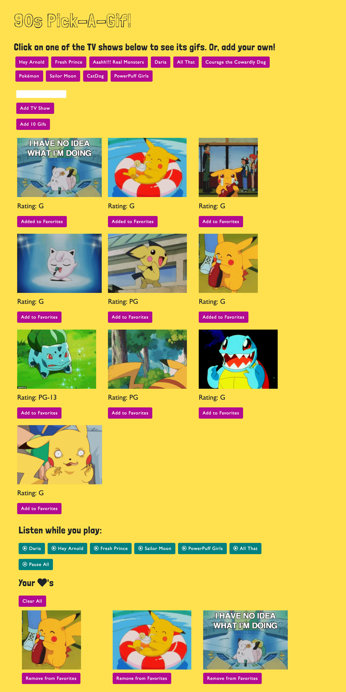

# 90s-pick-a-gif
### This game uses JS, jQuery, Bootstrap, and the Giphy API to retrieve and display gifs from 90s TV shows. Google Fonts and Font Awesome were used for additional styling.

### How to play:
* Select one of the pre-populated buttons to load gifs of that show. Or, enter the show of your choice and click _Add TV Show_. This creates a button that you can click to see gifs of that show.
* Click on the still image to animate the gif. Click again to pause it.

### Additional features:
* Click the _Add 10 Gifs_ button to add 10 new gifs of the current show.
* Listen while you play by clicking on one of the teal buttons. Any of these theme songs can be paused by clicking _Pause All_.
* Add and remove gifs from the favorites section.
* This game is fully mobile responsive (uses media queries).

#### Deployed at https://zoe-gonzales.github.io/pick-a-gif-90s/

### Step-by-step

#### Start page (desktop)

#### Clicking pre-populated gifs

#### Selecting favorites

#### Adding a button

